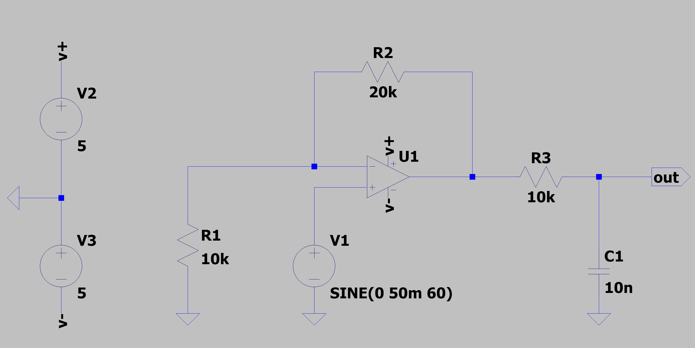
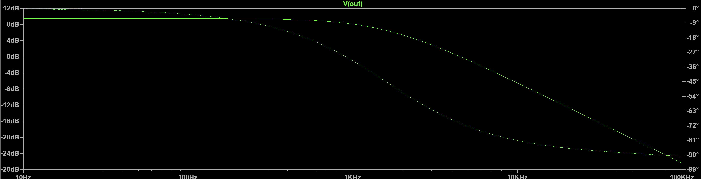
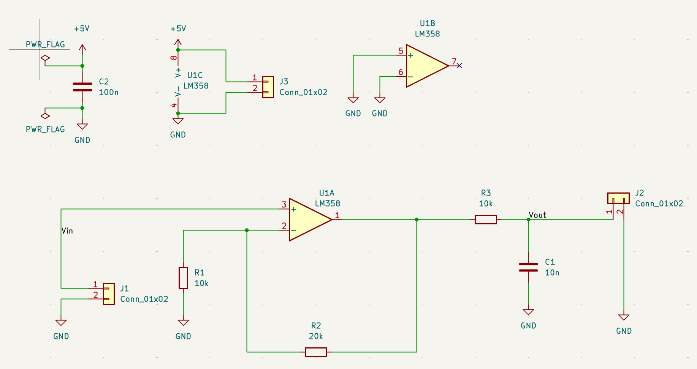
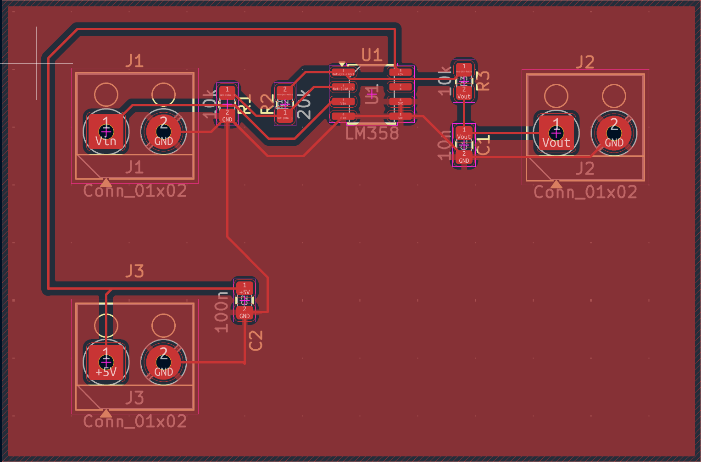
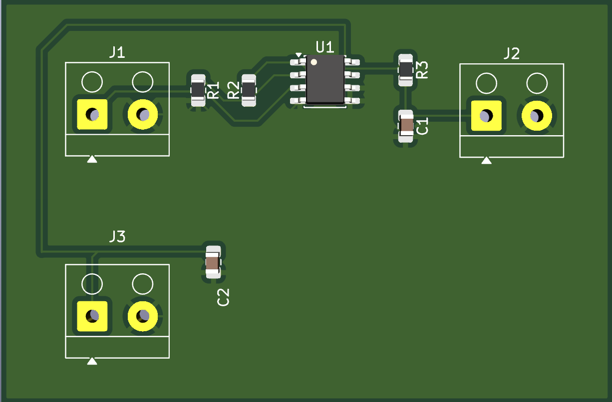
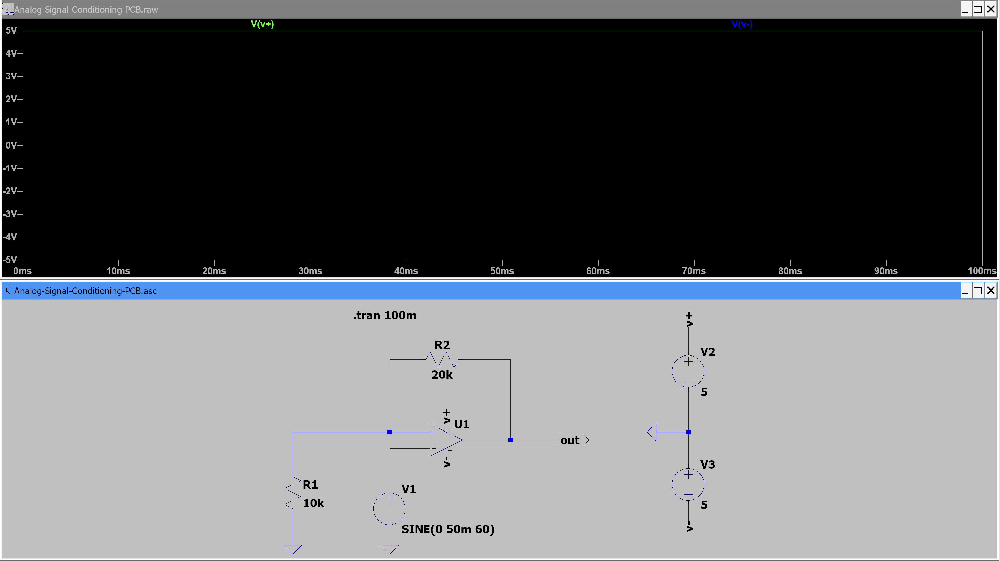
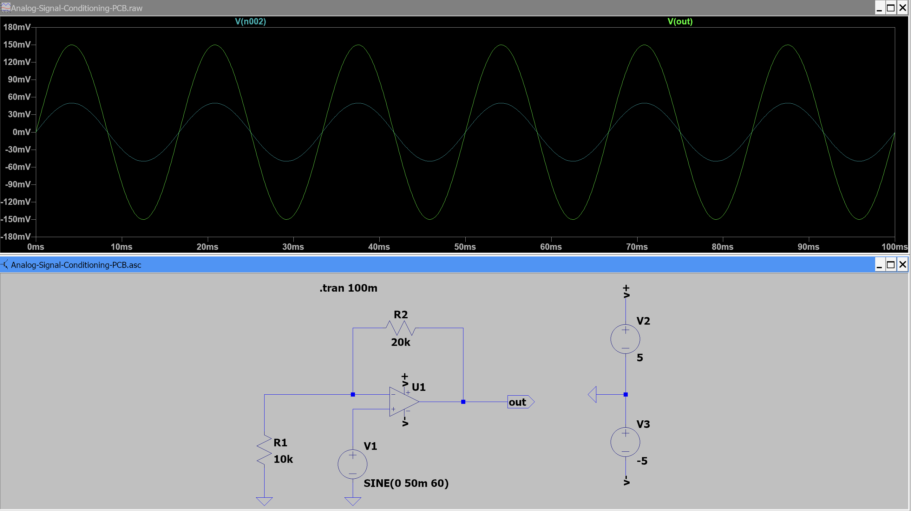
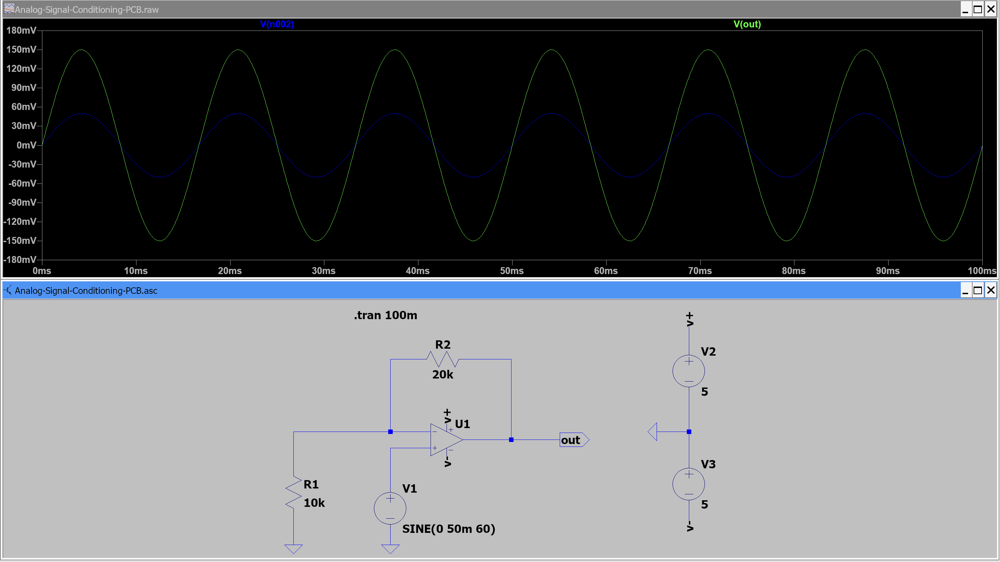
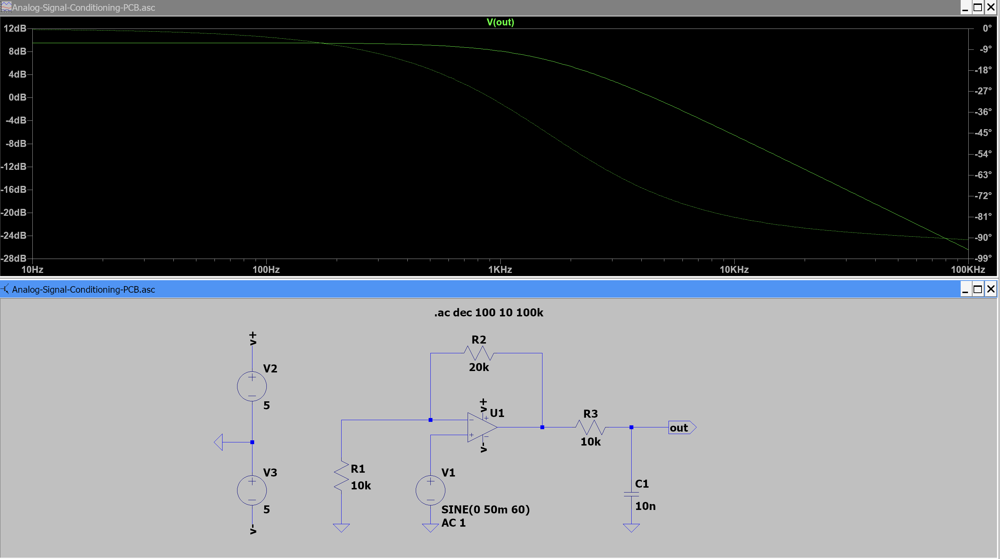

# Analog Signal-Conditioning PCB

## Overview

This project involves the design of a small analog signal-conditioning circuit intended to convert a 0–1 V sensor signal into a 0–3 V output suitable for microcontroller ADC interfacing.

The circuit was designed and simulated using LTspice and implemented
as a 2-layer PCB using KiCad.

## Objectives

- Design an analog amplification stage
- Implement low-pass filtering
- Maintain an ADC-compatible 0–3 V output
- Verify circuit behavior through simulation
- Design and verify a 2-layer PCB

## Tools

- LTspice
- KiCad

## Circuit Design

## LTspice Simulation

### Frequency Response

### Transient Response

## PCB Design

### Components

| Reference | Component | Value | Footprint |
|---|---|---|---|
| U1 | LM358 Dual Op-Amp | LM358 | `Package_SO:SOIC-8_3.9x4.9mm_P1.27mm` |
| R1 | Resistor | 10 kΩ | `Resistor_SMD:R_0805_2012Metric_Pad1.18x1.45mm_HandSolder` |
| R2 | Resistor | 20 kΩ | `Resistor_SMD:R_0805_2012Metric_Pad1.18x1.45mm_HandSolder` |
| R3 | Resistor | 10 kΩ | `Resistor_SMD:R_0805_2012Metric_Pad1.18x1.45mm_HandSolder` |
| C1 | Ceramic Capacitor | 10 nF | `Capacitor_SMD:C_0805_2012Metric_Pad1.18x1.45mm_HandSolder` |
| C2 | Ceramic Capacitor | 100 nF | `Capacitor_SMD:C_0805_2012Metric_Pad1.18x1.45mm_HandSolder` |
| J1 | 2-Pin Terminal Block | Input | `TerminalBlock_Altech:Altech_AK100_1x02_P5.00mm` |
| J2 | 2-Pin Terminal Block | Output | `TerminalBlock_Altech:Altech_AK100_1x02_P5.00mm` |
| J3 | 2-Pin Terminal Block | Power | `TerminalBlock_Altech:Altech_AK100_1x02_P5.00mm` |

### Connector Pinout

| Connector | Pin 1 | Pin 2 |
|---|---|---|
| J1 – Input | VIN | GND |
| J2 – Output | VOUT | GND |
| J3 – Power | +5 V | GND |

### Circuit Parameters

| Parameter | Value |
|---|---:|
| Supply Voltage | +5 V |
| Input Range | 0–1 V |
| Voltage Gain | 3× |
| Output Range | 0–3 V |
| Filter | RC Low-Pass |
| Cutoff Frequency | ~1.59 kHz |

### KiCAD schematic 

### PCB Layout

### 3D View

## Results

Simulation results and final design performance will be documented here.

## Verification Procedure

The circuit was verified using a node-by-node transient analysis.
Each verification step checks a specific electrical condition before
proceeding to the next stage.

### 1. Op-Amp Supply Voltage Verification

**Purpose:**  
Verify that the op-amp is receiving the required +5 V and −5 V supply
voltages before evaluating signal behavior.

**Procedure:**
1. Run a transient analysis in LTspice.
2. Probe the op-amp positive supply node (`V+`).
3. Probe the op-amp negative supply node (`V-`).
4. Confirm that the supply voltages are approximately +5 V and −5 V.
5. Verify that both supply voltages remain stable throughout the simulation.

**Expected Result:**

| Parameter | Positive Supply (`V+`) | Negative Supply (`V-`) |
|---|---:|---:|
| Supply voltage | +5 V | −5 V |
| Supply stability | Stable | Stable |

**Measured Result:**  
`V+ = 5.00 V`  
`V- = −5.00 V`

**Result:** Pass

### 2. Voltage Gain Verification

**Purpose:**  
Verify that the measured voltage gain agrees with the theoretical gain determined by the feedback resistors.

**Theoretical Gain:**

$$
A_v = 1 + \frac{R_2}{R_1}
$$

$$
A_v = 1 + \frac{20k\Omega}{10k\Omega} = 3
$$

**Procedure:**
1. Measure the input signal amplitude from the transient analysis.
2. Measure the output signal amplitude.
3. Calculate the measured voltage gain using:

$$
A_v = \frac{V_{out}}{V_{in}}
$$

4. Compare the measured gain with the theoretical gain of 3×.

**Expected Result:**

| Parameter | Expected |
|---|---:|
| Theoretical gain | 3× |
| Measured gain | ~3× |
| Gain error | Minimal |

**Measured Result:**  
`Theoretical gain = 3.00×`  
`Measured gain = Vout / Vin = 3.00×`

**Result:** Pass

### 3. Input and Op-Amp Output Verification

**Purpose:**  
Verify that the input signal has the expected amplitude and frequency, and that the op-amp produces the expected amplified output.

**Procedure:**
1. Run a transient analysis for 100 ms in LTspice.
2. Probe the input node of the op-amp.
3. Verify that the input signal is a 50 mV amplitude, 60 Hz sine wave centered around 0 V.
4. Probe the op-amp output node.
5. Verify that the output waveform follows the input waveform with the expected 3× voltage gain.
6. Compare the measured input and output amplitudes.

**Expected Result:**

| Parameter | Input | Op-Amp Output |
|---|---:|---:|
| Peak amplitude | 50 mV | ~150 mV |
| Peak-to-peak voltage | 100 mV | ~300 mV |
| Frequency | 60 Hz | 60 Hz |
| DC offset | 0 V | 0 V |
| Voltage gain | — | ~3× |

**Measured Result:**  
`Vin = 50 mV peak`  
`Vout = 150 mV peak`  
`f = 60 Hz`  
`Gain = Vout / Vin ≈ 3`

**Result:**  Pass

### 4. Filter Response Verification

**Purpose:**  
Verify the frequency response of the RC low-pass filter and confirm that the measured cutoff frequency agrees with the theoretical value.

**Filter Configuration:**

| Component | Value |
|---|---:|
| R3 | 10 kΩ |
| C1 | 10 nF |
| Filter type | Low-pass |

**Theoretical Cutoff Frequency:**

$$
f_c = \frac{1}{2\pi R_3 C_1}
$$

$$
f_c = \frac{1}{2\pi(10\,k\Omega)(10\,nF)}
$$

$$
f_c \approx 1.59\,kHz
$$

**Procedure:**
1. Set the input voltage source AC amplitude to 1 V for AC analysis.
2. Run an AC analysis using:
   `.ac dec 100 10 100k`
3. Plot the output voltage magnitude `V(VOUT)`.
4. Identify the low-frequency output magnitude.
5. Determine the frequency where the magnitude is approximately 3 dB below the low-frequency value.
6. Compare the measured cutoff frequency with the theoretical value.

**Expected Result:**

| Parameter | Expected |
|---|---:|
| Low-frequency gain | ~9.54 dB |
| Filter type | Low-pass |
| Theoretical cutoff frequency | ~1.59 kHz |
| Magnitude at cutoff | ~6.54 dB |
| Roll-off after cutoff | ~−20 dB/decade |

The low-frequency gain is approximately 9.54 dB because the op-amp provides a voltage gain of 3×:

$$
20\log_{10}(3) \approx 9.54\ dB
$$

Therefore, the -3 dB cutoff point is approximately:

$$
9.54 - 3 = 6.54\ dB
$$

**Measured Result:**  
`Low-frequency gain ≈ 9.5 dB`  
`Measured cutoff frequency ≈ 1.6 kHz`

The measured cutoff frequency agrees closely with the theoretical value of approximately 1.59 kHz.

**Result:** Pass

## Files

- `LTspice/` — circuit simulations
- `KiCad/` — schematic and PCB design files
- `Documentation/` — design images and results
- `BOM/` — bill of materials
- `Gerbers/` — manufacturing outputs
